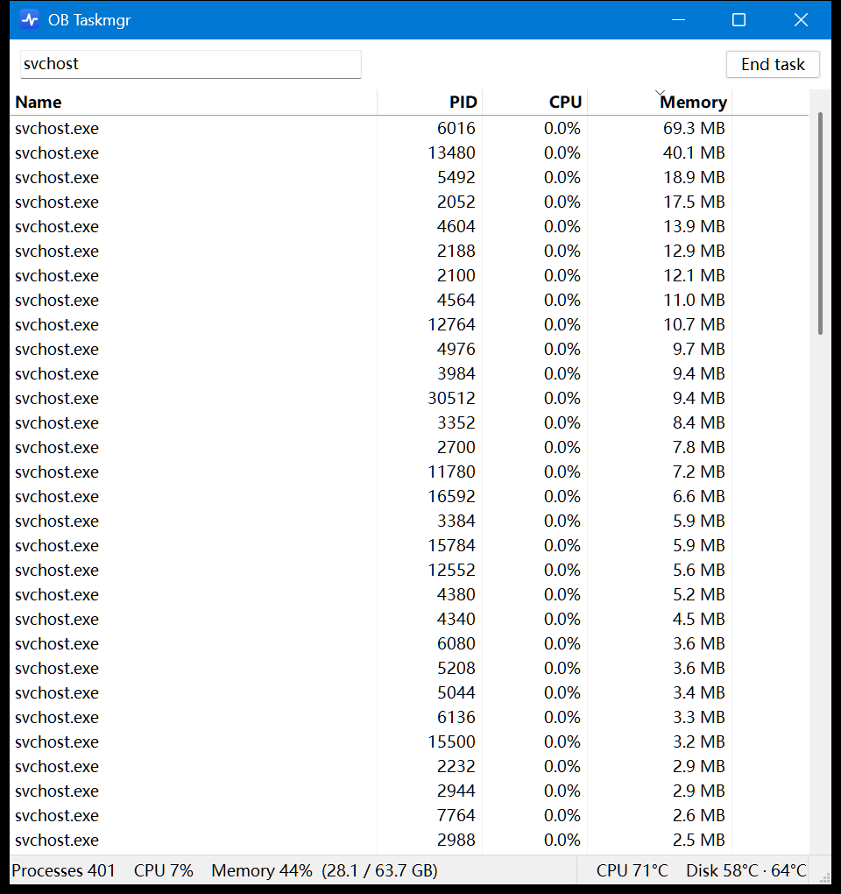

# OB Taskmgr

A tiny, fast task manager for Windows. It's a single 77 KB exe with no dependencies, and it opens instantly.

Windows Task Manager is slow to open and uses a lot of resources while you look at it. OB Taskmgr shows the essentials (processes, PID, CPU and memory) at a fraction of the cost.



## Resource usage

Both apps ran side by side with their windows visible, sampled over 60 s.

| | Windows Task Manager | OB Taskmgr |
|---|---|---|
| Time to open | 594 ms | **87 ms** |
| Private memory | ~115 MB | **~10 MB** |
| Working set | ~175 MB | **~20–27 MB** |
| CPU time per minute | 11.6–24 s | **1.1–3.8 s** |
| Minimized | keeps refreshing | **stops refreshing** |

Test machine: Windows 11, Intel i9-12900HX (24 threads), 150% display scaling, ~400 processes. The numbers varied between runs with overall system load, but OB Taskmgr used far less in every run.

## Features

- Process list with name, PID, CPU and memory, refreshed every second
- CPU is shown as a percentage of the whole machine. Memory is the private working set, the same metric as Task Manager's "Memory" column.
- Search by process name (substring match, case-insensitive) or exact PID
- Click a column header to sort, and click again to reverse the order
- End a process with the **End task** button or the <kbd>Del</kbd> key, after a confirmation prompt
- Rows with high usage are highlighted:

  | | CPU | Memory |
  |---|---|---|
  | Yellow (warning) | ≥ 10% | ≥ 1 GB |
  | Red (critical) | ≥ 30% | ≥ 4 GB |

- Status bar with the process count, total CPU and memory usage, plus CPU and disk temperatures when available
- Tray icon: minimizing hides the window to the tray. Click the icon to restore the window, or right-click for **Restore / Exit**.
- DPI-aware, and uses the system UI font

## Download

Grab `obtaskmgr.exe` from the [latest release](https://github.com/kookob/ob-taskmgr/releases/latest). No installation is needed: put the exe anywhere and run it. Release builds are compiled by GitHub Actions from the tagged source.

## Build

Requires [MinGW-w64](https://www.mingw-w64.org/) (`gcc` and `windres` on `PATH`).

```bat
build.bat
```

This produces `obtaskmgr.exe`, a statically linked exe that only depends on Windows system DLLs.

## Usage notes

- **Ending system or elevated processes** requires running OB Taskmgr as administrator (right-click → *Run as administrator*).
- **CPU temperature** comes from the ACPI thermal zone reported by the BIOS/EC. On most laptops this sensor sits near the CPU, but it isn't the per-core temperature that tools like HWiNFO show. Many desktops have no thermal zone, or report a fixed dummy value. If no thermal zone is available, the reading is hidden.
- **Disk temperature** uses the Windows storage temperature API (NVMe and most SSDs) and doesn't need admin rights. It's read every 10 seconds. Hard disks (HDDs) are skipped so the app never wakes a sleeping disk.
- Readings that aren't available are simply not shown.

## How it stays light

- A single `NtQuerySystemInformation` call per refresh returns every process, with no per-process `OpenProcess`.
- A virtual (owner-data) ListView formats text only for the rows on screen.
- Only rows whose text actually changed are repainted, one row at a time. Repainting is the main cost, at about 1 ms per row.
- Nothing is refreshed while the window is minimized.

## Customization

- **UI text**: every user-visible string is in the `TXT_*` block at the top of `taskmgr.c`. Translate those lines to localize the app.
- **Highlight thresholds**: `CPU_WARN`, `CPU_HIGH`, `MEM_WARN` and `MEM_HIGH`, right below the text block.

## Compatibility

Tested on Windows 11 x64 only. Windows 10 should work but hasn't been verified yet. Issue reports are welcome.

## License

[MIT](LICENSE)
